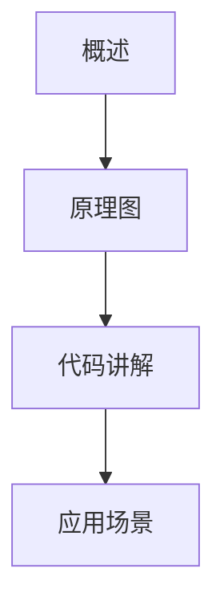

# Video2Note: 多厂商 AI 视频笔记生成工具

Video2Note 是一个**支持多厂商 AI 的视频转写与笔记生成工具**，可以将视频内容自动转写、生成 Markdown 技术笔记，并同步到 Notion 数据库。所有参数和 API 配置都可通过 YAML 文件进行管理，支持多厂商切换（OpenAI、Anthropic、Gemini、Qwen、Ernie、vLLM）。


## 功能特点

- ✅ **视频下载**：支持 YouTube、Bilibili 等平台（使用 youtube-dl）  
- ✅ **多厂商转写**：支持 OpenAI Whisper、本地 Whisper，以及占位接口供未来扩展  
- ✅ **多厂商摘要生成**：OpenAI GPT 系列真实调用，其他厂商接口占位  
- ✅ **Markdown 输出**：生成包含章节、代码、Mermaid 图、总结的技术笔记  
- ✅ **Notion 同步**：将笔记直接同步到 Notion 数据库  
- ✅ **配置可控**：视频源、输出路径、AI 供应商、模型、Notion 参数全在 YAML 文件中配置  
- ✅ **可扩展**：支持增加新 AI 厂商或本地模型  


## 项目流程

```mermaid
flowchart TD
    A[视频 URL] --> B[视频下载器]
    B --> C[音频提取 <ffmpeg>]
    C --> D[多厂商转写]
    D --> E[多厂商摘要生成]
    E --> F[Markdown 笔记生成]
    F --> G[Notion 同步 <可选>]
````

## 目录结构

```text
video2note/
├── config/
│   ├── config.yaml          # 项目通用配置
│   ├── providers.yaml       # AI 供应商配置
├── src/
│   ├── downloader.py        # 视频下载
│   ├── transcriber.py       # 多厂商转写
│   ├── summarizer.py        # 多厂商摘要生成
│   ├── notion_sync.py       # Notion 同步
│   ├── utils.py             # 工具函数
│   └── main.py              # 主流程
├── requirements.txt
├── README.md
└── run.sh
```


## 配置说明

### `config/config.yaml`

```yaml
video:
  source: "https://www.bilibili.com/video/BV1NCgVzoEG9/"
  download_path: "./downloads"
  language: "zh"

output:
  markdown_path: "./notes"
  include_images: true
  mermaid_diagrams: true
  auto_summary_sections: ["概述", "原理图", "代码讲解", "应用场景"]

ai:
  default_provider: "openai"
  model: "gpt-4o-mini"
  temperature: 0.7

notion:
  enable: true
  token: "notion-secret-xxx"
  database_id: "xxxx-xxxx-xxxx"
  tags: ["AI 学习", "视频总结"]
  publish_status: "Published"
```

### `config/providers.yaml`

* 配置各 AI 供应商的 API Key、Endpoint、可用模型
* 支持 OpenAI、Anthropic、Gemini、Qwen、Ernie、vLLM
* Prompt 模板可自定义，用于生成 Markdown 笔记

---

## 快速开始（Quick Start）

### 1. 安装依赖

```bash
pip install -r requirements.txt
```

### 2. 配置参数

* 编辑 `config/config.yaml` 设置视频源、输出路径、AI 供应商、Notion 参数
* 编辑 `config/providers.yaml` 填写各 AI 供应商 API Key 和 Endpoint

### 3. 运行项目

```bash
bash run.sh
```

执行后，流程如下：

1. 下载视频到 `downloads/`
2. 音频提取并调用 AI 供应商转写
3. 调用 AI 生成 Markdown 技术笔记
4. Markdown 文件保存到 `notes/`
5. 自动同步笔记到 Notion（如果启用）

---

## 输出示例

**Markdown 文件示例：**

```markdown
# 视频笔记

## 视频文件
downloads/video.mp4

## 转写文本
这是视频的完整转写内容，包括技术讲解、代码示例和应用场景。

## 摘要
基于转写内容生成的笔记，包括章节、代码、Mermaid 图和总结。
```

**Mermaid 图示意：**




## 模块说明

* **downloader.py**：视频下载器，可根据 URL 下载视频
* **transcriber.py**：多厂商转写模块，支持真实 OpenAI Whisper 和占位接口
* **summarizer.py**：多厂商摘要生成模块，支持 OpenAI GPT 系列和占位接口
* **notion_sync.py**：将生成的笔记同步到 Notion 数据库
* **utils.py**：工具函数，包括创建目录、时间戳、YAML 加载
* **main.py**：主流程脚本，负责整合各模块，执行完整工作流


## 注意事项

* 请确保已安装 **ffmpeg**，用于音频提取
* 如果使用 OpenAI API，请确保已正确填写 API Key
* Notion 同步功能需要在 Notion 创建 Integration 并获取 Token
* 其他厂商 API 需要自行填写真实 Key 或 URL


## 扩展与二次开发

* 可新增 AI 供应商，只需在 `providers.yaml` 中添加配置，并在 `transcriber.py` / `summarizer.py` 中实现调用
* Markdown 模板可自定义，满足不同的笔记风格
* 支持本地模型部署（vLLM、Whisper）


