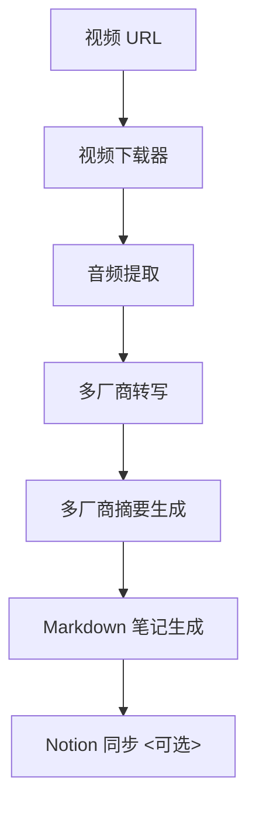

# Video2Note: 多厂商 AI 视频笔记生成工具

Video2Note 是一个**支持多厂商 AI 的视频转写与笔记生成工具**，可自动完成视频下载、音频提取、内容转写、结构化 Markdown 笔记生成，并同步至 Notion 数据库。所有参数（视频源、AI 供应商配置、输出格式等）通过 `config/config.yaml` 集中管理，支持多厂商模型切换（OpenAI、Anthropic、Gemini、Qwen、Ernie、vLLM、本地 Whisper 等）。


## 功能特点

- ✅ **多平台视频下载**：支持 YouTube、Bilibili 等平台（基于 yt-dlp/you-get/bilix）  
- ✅ **多厂商转写**：支持 OpenAI Whisper、本地 Whisper 及扩展接口（Gemini、Qwen 等）  
- ✅ **智能笔记生成**：通过 LLM 生成含章节、代码块、Mermaid 图的结构化 Markdown 笔记  
- ✅ **Notion 同步**：自动将笔记同步到 Notion 数据库，支持标签和状态管理  
- ✅ **全配置驱动**：视频源、AI 模型、输出路径等参数集中在 `config.yaml` 管理  
- ✅ **本地模型支持**：可部署本地 Whisper 转写模型，无需依赖外部 API  
- ✅ **高度可扩展**：轻松新增 AI 供应商或自定义 Markdown 生成模板  


## 项目流程




## 目录结构

```text
video2note/
├── config/
│   ├── config.yaml          # 项目全量配置（含视频、AI供应商、输出等）
│   └── bilibili_cookies.txt  # B站登录 cookies（可选）
├── src/
│   ├── downloader.py        # 视频下载模块
│   ├── transcriber.py       # 音频转写模块（多厂商支持）
│   ├── summarizer.py        # 笔记生成模块（多厂商支持）
│   ├── notion_sync.py       # Notion 同步模块
│   ├── utils.py             # 工具函数（配置加载、目录创建等）
│   └── main.py              # 主流程入口
├── downloads/               # 视频下载默认目录（含音频、关键帧子目录）
├── notes/                   # 笔记输出默认目录
├── requirements.txt         # 依赖清单
├── run.sh                   # 一键运行脚本
└── README.md                # 项目说明
```


## 快速开始

### 1. 安装依赖

```bash
# 安装 Python 依赖
pip install -r requirements.txt

# 安装 ffmpeg（用于音频/关键帧提取）
# - Ubuntu/Debian: sudo apt install ffmpeg
# - macOS: brew install ffmpeg
# - Windows: 下载并添加到环境变量（https://ffmpeg.org/）
```

### 2. 配置参数

编辑 `config/config.yaml` 完成所有配置（视频源、AI 供应商、Notion 等）：

```yaml
# 全局应用配置
app:
  mock: false           # 测试时启用 mock 模式（跳过真实 API 调用）
  log_level: "INFO"     # 日志等级：DEBUG / INFO / WARNING / ERROR

# 视频下载配置
video:
  url: "https://www.bilibili.com/video/BV1NCgVzoEG9/"  # 视频链接
  download_path: "./downloads"
  language: "zh"
  quality: "best"        # 支持 best, 1080, 720 等
  login:
    method: "cookies"    # 登录方式：cookies / qrcode / account
    cookies_path: "./config/bilibili_cookies.txt"
  frame_interval: 10     # 关键帧提取间隔（秒）

# AI 基础配置
ai:
  provider: "local"       # 选择 AI 供应商：openai / anthropic / gemini / local 等
  model: "gpt-4o-mini"    # 模型名称（根据供应商选择）
  temperature: 0.7        # 生成随机性（0-1）

# AI 供应商详细配置（含 API Key、模板等）
providers:
  openai:
    api_key: "sk--xxx"
    endpoint: "https://api.openai.com/v1/chat/completions"
    prompt_template: |
      基于以下视频内容生成技术笔记，包含「概述」「核心原理」「代码案例」「总结」等章节...
      内容：{{transcript}}

  anthropic:
    api_key: "claude-xxx"
    endpoint: "https://api.anthropic.com/v1/messages"

  gemini:
    api_key: "AIza-xxxx"
    endpoint: "https://generativelanguage.googleapis.com/v1beta/models/{{model}}:generateContent"

  local:
    summarizer: "rules"   # 本地笔记生成方式：rules（规则）/ light-nlp（轻量NLP）
    transcriber: "whisper" # 本地转写工具：whisper

# 输出配置
output:
  markdown_path: "./notes"
  include_images: true
  mermaid_diagrams: true
  auto_summary_sections: ["概述", "原理图", "代码讲解", "应用场景"]

# Notion 同步配置（可选）
notion:
  enable: true
  token: "notion-secret-xxx"
  database_id: "xxxx-xxxx-xxxx"
  tags: ["AI 学习", "视频总结"]
  publish_status: "Published"
```

### 3. 运行项目

```bash
bash run.sh
```

执行后自动完成以下流程：
1. 下载视频到 `downloads/` 目录（含音频提取、关键帧截取）
2. 调用指定 AI 供应商转写音频内容
3. 合并字幕与转写内容，生成结构化 Markdown 笔记
4. 保存笔记到 `notes/` 目录
5. 同步笔记到 Notion（若启用）


## 配置说明

### `config/config.yaml` 核心参数

| 模块        | 参数                | 说明                                  |
|-------------|---------------------|---------------------------------------|
| `app`       | `mock`              | 是否启用测试模式（跳过真实 API 调用） |
| `video`     | `url`               | 视频链接（支持 Bilibili/YouTube 等）  |
| `video`     | `frame_interval`    | 关键帧提取间隔（秒）                  |
| `ai`        | `provider`          | AI 供应商（openai/gemini/local 等）   |
| `ai`        | `model`             | 生成模型名称（需与供应商匹配）        |
| `providers` | `{provider}.api_key`| 对应供应商的 API Key（本地模型无需）  |
| `output`    | `markdown_path`     | Markdown 笔记保存目录                 |
| `notion`    | `enable`            | 是否启用 Notion 同步                  |
| `notion`    | `token/database_id` | Notion 集成凭证和目标数据库 ID        |


## 模块说明

- **downloader.py**：视频下载器，支持多平台视频/合集下载，自动保存到配置目录  
- **transcriber.py**：多厂商音频转写模块，支持 OpenAI Whisper（API/本地）、Gemini（占位）等  
- **summarizer.py**：笔记生成模块，基于转写内容生成结构化 Markdown（支持规则生成、轻量NLP、LLM）  
- **notion_sync.py**：将 Markdown 笔记同步到 Notion 数据库，支持新增/更新页面  
- **utils.py**：工具函数（配置加载、目录创建、日志管理等）  
- **main.py**：主流程控制，串联下载、转写、生成、同步全流程  


## 注意事项

- 确保 `ffmpeg` 已安装并添加到环境变量（用于音频/关键帧提取）  
- AI 供应商 API Key 需在 `config/config.yaml` 的 `providers` 部分正确配置  
- 本地模型（如 Whisper）首次运行会自动下载，建议配置 4GB+ 内存  
- Notion 同步需先创建 Integration 并获取 Token（参考 [Notion 开发者文档](https://developers.notion.com/)）  


## 扩展与二次开发

- **新增 AI 供应商**：在 `config/config.yaml` 的 `providers` 中添加配置，并在 `transcriber.py`/`summarizer.py` 实现调用逻辑  
- **自定义 Markdown 模板**：修改 `providers.{provider}.prompt_template` 调整生成格式  
- **支持新视频平台**：扩展 `downloader.py` 中的下载逻辑  


## 许可证

本项目基于 Apache License 2.0 开源，详见 [LICENSE](LICENSE) 文件。


