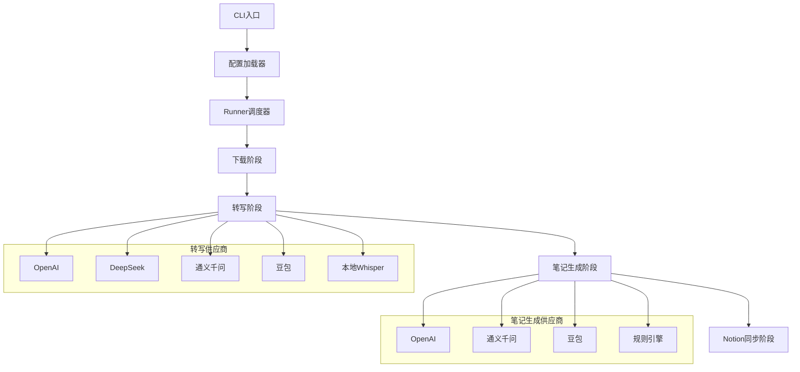

# Video2Note: 多平台视频笔记生成工具

Video2Note 是一个**支持多厂商AI的视频转写与结构化笔记生成工具**，可自动完成视频下载、音频提取、内容转写、结构化Markdown笔记生成，并可选同步至Notion数据库。

## ✨ 功能特点

- **多平台视频下载**：支持YouTube、Bilibili等平台视频下载
- **多厂商AI转写**：支持OpenAI、DeepSeek、通义千问(Qwen)、豆包(Doubao)、本地Whisper等多种转写服务
- **智能笔记生成**：通过LLM生成含章节、代码块等结构化Markdown笔记
- **Notion同步**：自动将笔记同步到Notion数据库
- **灵活配置**：全配置驱动，支持多种运行模式
- **高度可扩展**：基于工厂模式设计，易于扩展新功能和新的AI供应商

## 🛠️ 项目架构

项目采用模块化设计，每个功能模块独立封装，使用工厂模式实现AI供应商的可插拔切换：



## 📁 目录结构

```text
video2note/
├── config/               # 配置文件目录
│   ├── base_config.yaml  # 主配置文件
│   └── bilibili_cookies.txt # B站登录cookies（可选）
├── src/                  # 源代码目录
│   └── video2note/       # 主源码包
│       ├── cli.py        # 命令行入口
│       ├── config_manager/ # 配置管理模块
│       ├── core/         # 核心流程控制
│       ├── downloader/   # 视频下载模块
│       ├── transcriber/  # 音频转写模块
│       ├── summarizer/   # 笔记生成模块
│       ├── notion/       # Notion同步模块
│       ├── types/        # 数据类型定义
│       └── utils/        # 工具函数
├── downloads/            # 视频下载默认目录
├── notes/                # 笔记输出默认目录
├── .env                  # API密钥配置文件
├── .env.example          # 环境变量示例
├── requirements.txt      # Python依赖列表
├── pyproject.toml        # 项目元数据配置
├── run.sh                # 一键运行脚本
└── README.md             # 项目说明文档
```

## 🔧 快速开始

### 1. 安装依赖

```bash
# 安装Python依赖
pip install -r requirements.txt

# 安装ffmpeg（用于音频提取）
# - Ubuntu/Debian: sudo apt install ffmpeg
# - macOS: brew install ffmpeg
# - Windows: 下载并添加到环境变量（https://ffmpeg.org/）
```

### 2. 配置API密钥

复制`.env.example`文件并重命名为`.env`，然后填入你的API密钥：

```bash
cp .env.example .env
# 编辑.env文件，填入API密钥
```

### 3. 配置项目参数

编辑`config/base_config.yaml`文件，设置视频源、AI供应商和输出参数：

```yaml
# 示例配置（详细配置请参考完整配置文件）
app:
  mock: false           # 测试时启用mock模式
  log_level: "INFO"

video:
  url: "https://www.bilibili.com/video/BV1xx4y1r72m/"  # 视频链接
  download_path: "./downloads"
  language: "zh"
  quality: "best"

# 转写配置
transcriber:
  provider: "openai"    # openai/deepseek/qwen/doubao/local_whisper
  model: "whisper-1"

# 笔记生成配置
summarizer:
  provider: "openai"    # openai/qwen/doubao/rule
  model: "gpt-4o-mini"
  temperature: 0.7

# Notion配置（可选）
notion:
  enable: false
  api_key: "secret_xxx"
  database_id: "xxx"
```

### 4. 运行程序

使用一键运行脚本或直接运行命令行：

```bash
# 使用一键运行脚本
bash run.sh

# 或使用命令行运行，指定配置文件和模式
python -m src.video2note.cli --config config/base_config.yaml --mode full
```

## 🚀 使用模式

Video2Note支持多种运行模式，可通过`--mode`参数指定：

- `full`: 执行完整流程（下载→转写→笔记生成→Notion同步）
- `download-only`: 仅下载视频
- `transcribe-only`: 仅进行音频转写
- `summarize-only`: 仅生成笔记
- `sync-only`: 仅同步到Notion

```bash
# 示例：仅下载视频
python -m src.video2note.cli --config config/base_config.yaml --mode download-only
```

## 🔍 支持的AI供应商

### 音频转写供应商
- **OpenAI**：使用OpenAI的Whisper模型
- **DeepSeek**：使用DeepSeek的转写服务
- **通义千问(Qwen)**：使用阿里云的通义千问模型
- **豆包(Doubao)**：使用字节跳动的豆包模型
- **本地Whisper**：在本地运行Whisper模型，无需API调用
- **Mock**：用于测试的模拟转写器

### 笔记生成供应商
- **OpenAI**：使用GPT系列模型
- **通义千问(Qwen)**：使用阿里云的通义千问模型
- **豆包(Doubao)**：使用字节跳动的豆包模型
- **规则引擎(Rule)**：基于规则的简单笔记生成器

## 🎯 核心模块说明

### 1. 下载器模块 (`downloader/`)
负责从各种视频平台下载视频内容，支持YouTube、Bilibili等平台，使用yt-dlp、bilix等工具实现。

### 2. 转写器模块 (`transcriber/`)
将视频中的音频转换为文本，支持多种AI供应商，通过工厂模式实现可插拔设计。

### 3. 笔记生成器模块 (`summarizer/`)
将转写文本处理成结构化的Markdown笔记，支持添加章节、代码块等元素。

### 4. Notion同步模块 (`notion/`)
将生成的Markdown笔记同步到Notion数据库，支持自定义属性和标签。

### 5. 配置管理模块 (`config_manager/`)
负责加载和验证配置文件，确保程序正常运行所需的参数正确无误。

## 🔧 常见问题

### 1. 视频下载失败
- 检查网络连接和视频URL是否正确
- 对于需要登录的平台，确保已配置正确的cookies
- 查看日志获取详细错误信息

### 2. API调用失败
- 确认.env文件中的API密钥是否正确配置
- 检查网络连接和防火墙设置
- 查看API提供商的使用限制和配额

### 3. Notion同步失败
- 确认Notion API密钥和数据库ID是否正确
- 检查数据库权限设置
- 确认生成的Markdown格式是否符合Notion要求

## 🤝 贡献指南

欢迎对项目进行贡献！如果你有任何想法或发现问题，请提交issue或pull request。

1. Fork项目仓库
2. 创建你的特性分支 (`git checkout -b feature/AmazingFeature`)
3. 提交你的更改 (`git commit -m 'Add some AmazingFeature'`)
4. 推送到分支 (`git push origin feature/AmazingFeature`)
5. 开启Pull Request

## 📄 许可证

该项目采用MIT许可证 - 详见[LICENSE](LICENSE)文件

## 📧 联系我们

如有任何问题或建议，请联系：deathwhispers@qq.com